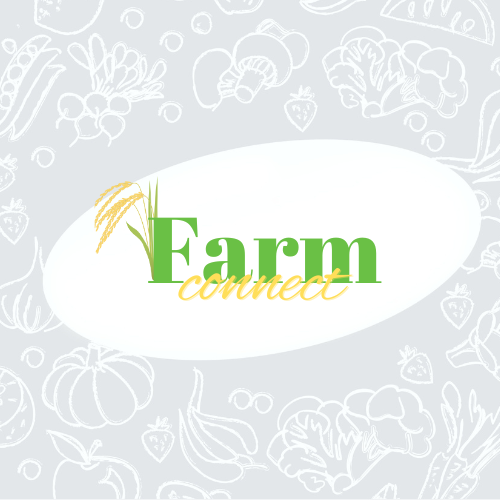

<div>

# 🌾 Farm Connect – PHP E-Commerce for Fresh Farm Products

[](https://www.php.net/)
[](https://www.mysql.com/)
[](https://getbootstrap.com/)
[](https://developer.paypal.com/)
[](LICENSE)

> **Connecting farmers and consumers directly for fresher products and fairer prices** 🛒🌱

</div>

---

<table>
  <tr>
    <td valign="middle" width="200" align="center">
      
    </td>
    <td valign="top">
      <h2>🎯 Overview</h2>
      <p><strong>Farm Connect</strong> is an innovative PHP + MySQL based e-commerce platform designed to empower farmers by providing a <strong>direct farm-to-table marketplace</strong>.</p>
      <p>This platform bridges the gap between producers and consumers, allowing customers to benefit from fresher products at better prices, while farmers enjoy fair profits without the need for intermediaries.</p>
    </td>
  </tr>
</table>

### ✨ Key Highlights
- 🌾 **Fresh farm products** with real-time inventory  
- 💳 **Secure PayPal integration** for smooth transactions  
- 🔎 **Advanced product search & filtering**  
- 📦 **Order tracking & management**  
- 👩‍🌾 **Farmer & consumer dashboards**  
- 🛒 **Seamless shopping experience**  

---

## 🖥️ Live Demo  

<div align="center">
  
  <br/>
  <sub><strong>🏠 Homepage:</strong> Fresh farm products with intuitive navigation.</sub>
  <br/><br/>
  
  <br/>
  <sub><strong>🥦 Popular Products:</strong> Showcase of most-wanted farm items.</sub>
  <br/><br/>
  
  <br/>
  <sub><strong>🛒 Shopping Cart:</strong> Easy quantity management and order summary.</sub>
  <br/><br/>
  
  <br/>
  <sub><strong>💳 Checkout:</strong> Simple and clean checkout form.</sub>
  <br/><br/>
  
  <br/>
  <sub><strong>💸 PayPal Payment:</strong> Secure and seamless payment with the PayPal API.</sub>
</div>

---

## 🚀 Core Features  

### 🛍️ **Shopping Experience**
- Real-time product availability  
- Easy cart management & checkout  
- Popular product highlights  

### 👨‍🌾 **Farmer Dashboard**
- Manage product listings  
- Track sales and earnings  
- Update inventory seamlessly  

### 👩‍💻 **Consumer Dashboard**
- Track order status  
- Manage profile & preferences  
- View order history  

### 🔐 **Payment System**
- Secure PayPal API integration  
- Instant order confirmation  
- Transparent transaction logs  

---

## 🌱 Why Farm Connect?  

<div>

Traditional markets rely on **intermediaries**, which often:  

❌ Increase costs for consumers  
⚠️ Reduce profits for farmers  

**Farm Connect eliminates these middlemen** by enabling direct producer-to-consumer trade.  

✅ Fresher products  
✅ Fairer prices  
✅ More sustainable ecosystem  

</div>

---

## 🛠️ Getting Started  

### 📋 Prerequisites
- **PHP 8.2+**  
- **MySQL 8.0+**  
- **XAMPP / WAMP / LAMP** stack  
- **Composer** (for dependency management)  

### ⚡ Quick Setup

1.  **Clone the repository**
    ```bash
    git clone <your-repo-url>
    cd farm-connect
    ```

2.  **Import the database**
    - Open phpMyAdmin.
    - Create a new database named `farm_connect`.
    - Import the `farm_connect.sql` file into the new database.

3.  **Configure the environment**
    - Update `config/config.php` with your database and PayPal API credentials.

4.  **Run the application**
    - Start Apache & MySQL (via XAMPP/WAMP/LAMP).
    - Visit: `http://localhost/farmconnect` in your browser.

---

## 🛡️ Technologies

| Technology      | Purpose                         |
| --------------- | ------------------------------- |
| **PHP 8.2**       | Backend logic & server-side scripting |
| **MySQL 8.0**     | Relational database management  |
| **Bootstrap 4.6** | Responsive UI framework         |
| **JavaScript/jQuery** | Interactivity & client-side features |
| **PayPal API**    | Secure payment integration      |

---

## 📜 License & Acknowledgements

This project is licensed under the MIT License - see the [LICENSE](LICENSE) file for details.

A significant portion of the user interface and base structure was inspired by the work of **Teguh Rianto**, whose original project is also licensed under the MIT License.

`Copyright (c) 2018 Teguh Rianto`

---

<div align="center">
<strong>🌾 Fresh • Fair • Direct</strong>
<br/>
<em>Built with ❤️ using PHP, MySQL & modern web technologies</em>
</div>
